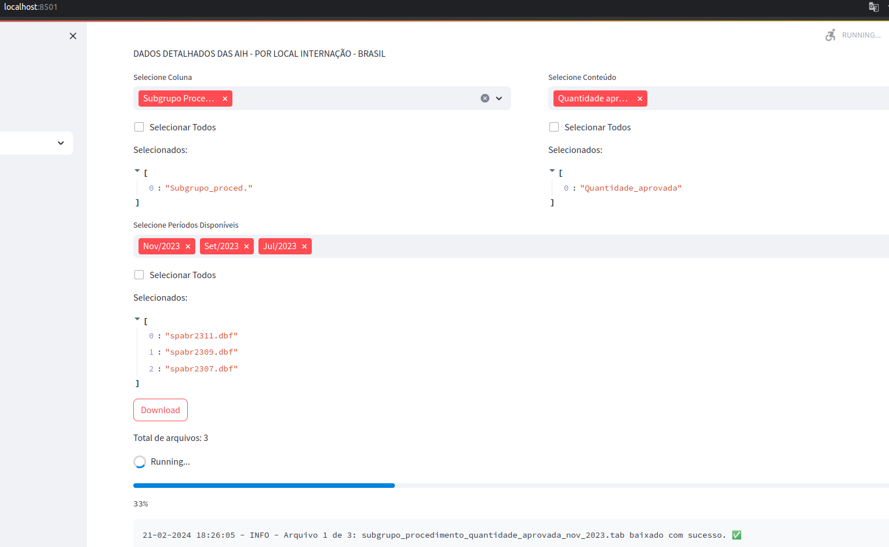

# Projeto Desafio Ciência de Dados

Este é um projeto Python para análise de dados utilizando as bibliotecas Streamlit e pandas.

## Descrição do Projeto

O Projeto DATASUS é um conjunto de ferramentas desenvolvidas em Python para extração e análise de dados do DATASUS. Inicialmente, o projeto consiste em um crawler que extrai dados do DATASUS e realiza tratamento inicial nos dados extraídos. Esses dados podem então ser explorados e analisados utilizando a aplicação desenvolvida com a biblioteca Streamlit.


## Instalação


1. Clone este repositório:
```
git clone https://github.com/linocesar/desafio_ciencia_de_dados.git
```
2. Navegue até o diretório do projeto:
```
cd desafio_ciencia_de_dados
```
3. Crie um ambiente virtual utilizando o módulo `venv`:
```
python -m venv venv
```
4. Ative o ambiente virtual:

    - No Windows:

    ```
    venv\Scripts\activate
    ```

    - No macOS e Linux:

    ```
    source venv/bin/activate
    ```

5. Instale as dependências utilizando pip:
    ```
    pip install -r requirements.txt
    ```
## Execução da Aplicação Streamlit

1. Navegue até o diretório 'web':

    ```
    cd datasus/web
    ```

2. Execute o arquivo `app.py` com o comando:

    ```
    streamlit run app.py
    ```

Isso iniciará a aplicação Streamlit e abrirá automaticamente uma página no seu navegador padrão com a aplicação em execução.

## Preview da Aplicação

